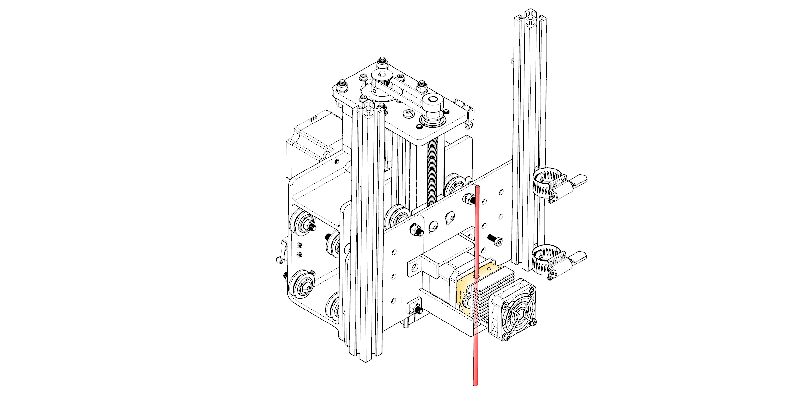
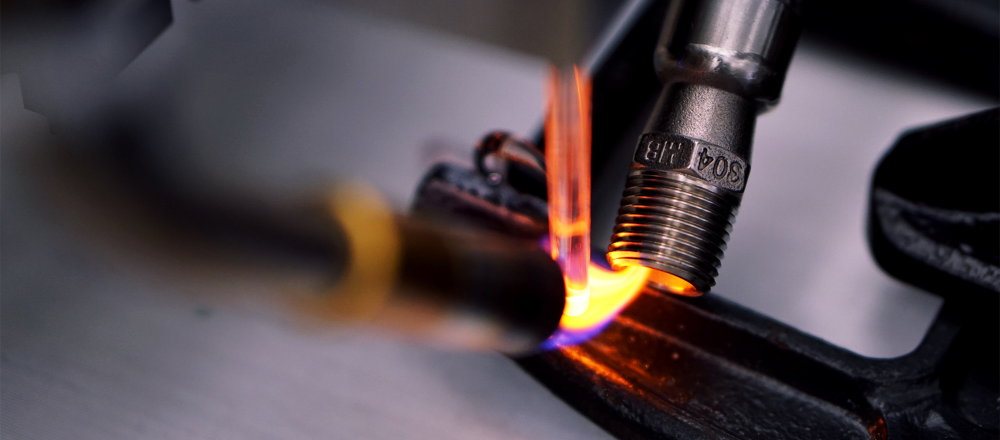

Quartz is a material research project that unites state of the art computer-aided rapid prototyping technology (CNC) with glass - one of the most versatile design materials.

Using open source CNC hardware and custom-developed software, this speculative project aims to develop a novel computer-aided material process for the use of glass in the formation of two and three-dimensional artifacts. This project can be broadly divided into 3 categories:

- Material Research
- Machine Customization
- Parametric modelling

You'll need to be familiar with basic CAD modelling and CNC fabrication. The Resources page lists the breakdown of setup you'll need in order to get started. We recommended that you read through all materials and take the steps outlined here before getting started experimenting with glass extrusions. There is a bit of a learning curve.

