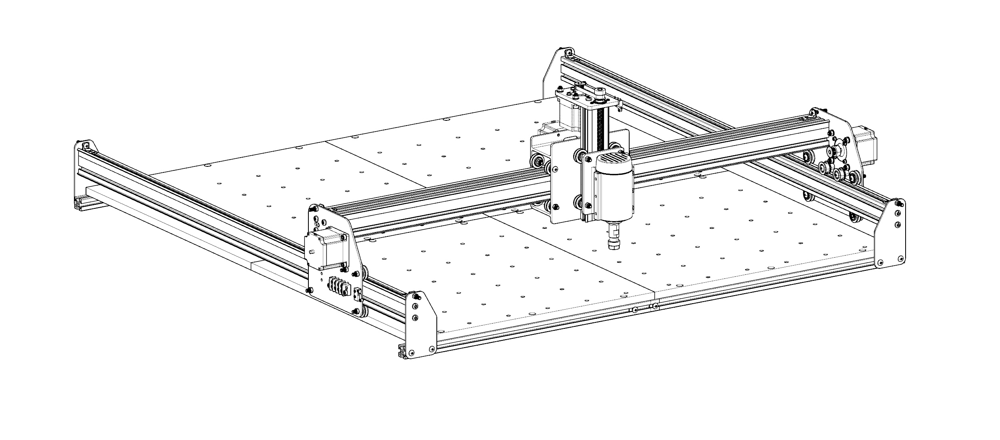
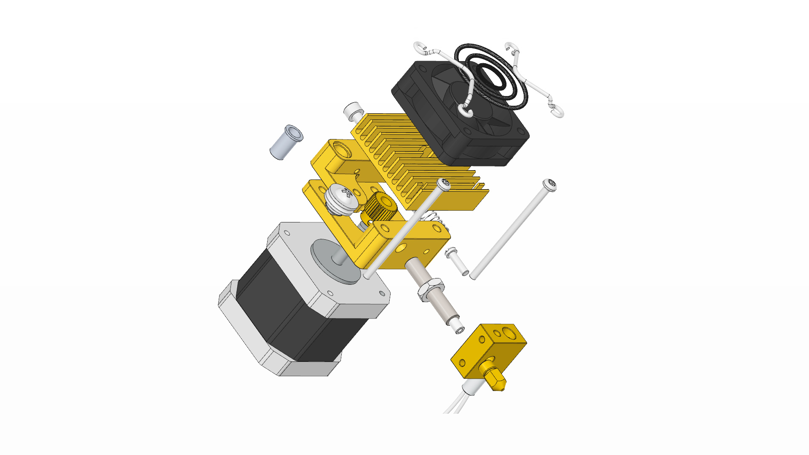
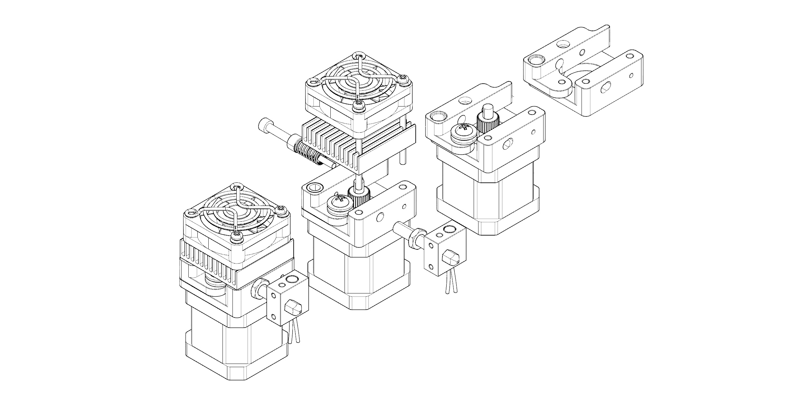
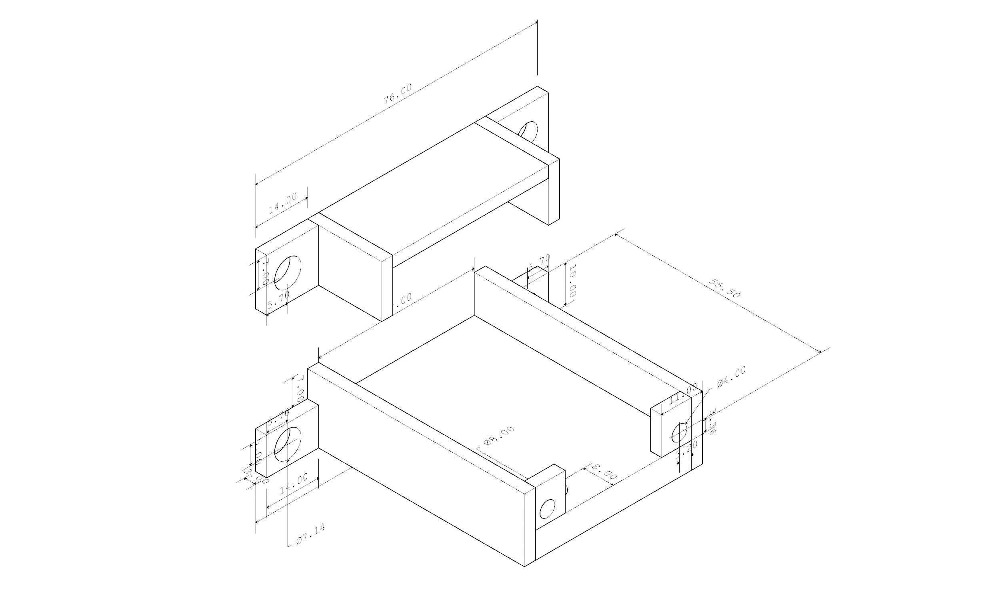
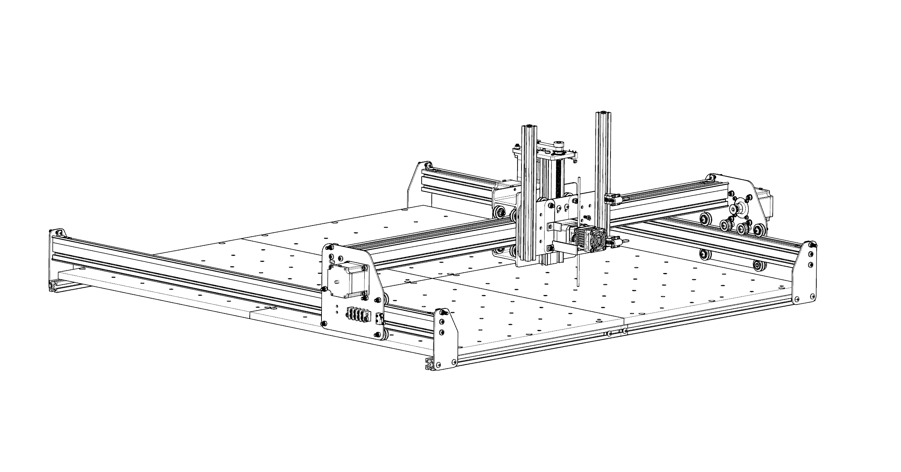

## X Carve 1000mm

The model for the X-Carve 1000mm and its parts is available on [GrabCAD Workbench](https://workbench.grabcad.com/workbench/projects/gcl5zpCuwqCXWLvYktLQBc-2IHvossNo37ycTOkzg6gREW#/space/gcvs_XeRNVzNkfG_tFTAMd0C2lBbCsLcagOxXb1Jlki0kT/folder/858489).

---

## Extruder Original CAD

The reference file for the 3D printer extruder was taken from [GrabCAD Library](https://grabcad.com/library/china-extruder-for-3d-printer-from-aliexpress-1).

---

## Extruder Modification

The extruder will require to be machined in order to enlarge the feed and extrusion openings. More details can be found in the linked CAD files. It is highly recommended to carry out your own measurements specific to the extruder you own. These drawings are intended to provide a guide to share the required modifications.

  <iframe width="100%" height="480" src="https://sketchfab.com/models/ec986721a17f40f2b00fd561553fb349/embed" frameborder="0" allowfullscreen mozallowfullscreen="true" webkitallowfullscreen="true" onmousewheel=""></iframe>

[Download .3dm Rhino File](https://www.dropbox.com/s/v5pvn5o80edqq0c/extruder%20mod.3dm?dl=0) | [Download .stp File](https://www.dropbox.com/s/hwm30xc2ja88o7x/extruder%20mod.stp?dl=0)

---

## Aluminium Mounts for the Extruder

You'll need some basic experience for Lathe Machining. Please seek help from a workshop technician for extra assistance. The drawings are annotated with measurements in the Rhino file. They may vary depending upon the model of your extruder and the glass rods you own.

  <iframe width="100%" height="480" src="https://sketchfab.com/models/8a998a0730a74d8391d096257696d2f6/embed" frameborder="0" allowfullscreen mozallowfullscreen="true" webkitallowfullscreen="true" onmousewheel=""></iframe>

[Download .3dm Rhino File](https://www.dropbox.com/s/8g3itv43fneh8n2/extruder%20mount.3dm?dl=0) | [Download .stp File](https://www.dropbox.com/s/jf1a3pl2my2fpgk/extruder%20mount.stp?dl=0)

---

## Final Assembly

[Download .3dm Rhino File](https://www.dropbox.com/s/xrf9nrrtaag5o8s/Xcarve_mod.3dm?dl=0)
