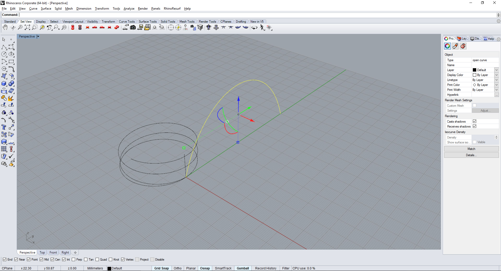
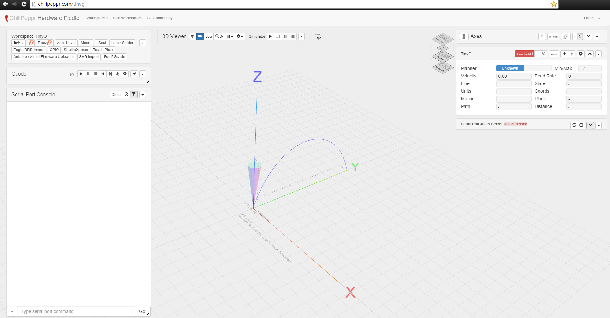

## Requirements

- [McNeel Rhino](https://www.rhino3d.com/)
- [Serial Port JSON Server](https://github.com/johnlauer/serial-port-json-server)
- [TinyG - Hardware Fiddle](https://github.com/synthetos/TinyG/wiki/Chilipeppr)

---

## Setup the TinyG Board

- Install [FTDI Drivers](https://github.com/synthetos/TinyG/wiki/Connecting-TinyG#install-ftdi-drivers)
- Power up and connect the TinyG board using via USB to your computer.
- Run the Serial Port JSON Server and leave it running in the background.
- Open your browser and go to [chilipeppr.com/tinyg](http://chilipeppr.com/tinyg)
- Go to the Serial Port JSON Server fiddle in bottom right and refresh to see the TinyG listed.
- Select and connect to the board.
- **Change the following settings:**
  - Change Latch Velocity to 50
  - X and Y Travel/rev = 36.54
  - X and Y Microsteps = 8
  - Z Travel/rev = 1.25
  - Z microsteps = 4

---

## Workflow

### Generate the Geometry

- The extrusion path is first created in Rhino. All the measurements are in millimeters unless otherwise specified.
- Run the Python Script Editor in Rhino. Use command: **EditPythonScript** in Rhino Console.
- Run [this script](https://gist.github.com/jaskiratr/9baad314e0218bfb0174f3a6bb7eccc1#file-quartz-rhino-python-script-py) to generate a G-Code file. The code has been taken and modified from [timcastelijn/gcode-generator](https://github.com/timcastelijn/gcode-generator).
- Copy the contents of the saved file that contains the newly written G-Code. Paste it in Chilipeppr to perform the extrusion.



### Run the Extrusion

- This project used browser based Chilipeppr workspace to control the machine.
- Open your browser and go to [chilipeppr.com/tinyg](http://chilipeppr.com/tinyg)
- Go to the Serial Port JSON Server fiddle in bottom right and refresh to see the TinyG listed.
- Select and connect to the board.
- Go to 'Workspace TinyG' fiddle on top left and click the load GCode button. Paste the contents under 'Open Gcode From Clipboard'.
- Insert the glass rod in the extruder and zero the machine to the correct point for extrusion.
- Power on the air-compressor to start the vacuum and ignite the propane torch at low flame. Leave it on for a few seconds till the glass is in semi-liquid state.
- Press play button in Chilipeppr GCode fiddle to initiate the movement of the machine.



**Useful Links**

- [TinyG Documentation](https://github.com/synthetos/TinyG)
- [Shapeoko TinyG Setup](https://github.com/synthetos/TinyG/wiki/TinyG-Shapeoko-Setup)
- [Chilipeppr Documentation](https://github.com/synthetos/TinyG/wiki/Chilipeppr)
- [TinyG G-Code Generator](https://github.com/timcastelijn/gcode-generator)
- [Modified G-Code Generator](https://gist.github.com/jaskiratr/9baad314e0218bfb0174f3a6bb7eccc1#file-quartz-rhino-python-script-py)

```python
# Modified from : https://github.com/timcastelijn/gcode-generator
feedrate= 85   # Carriage Speed | Increment by +- 5
curve_tolerance=0.008
curve_angle_tolerance=5
z_offset = 0
material_mult = 0.01 # Extrusion Speed: A-Axis | Increments of +- 0.001
extruder_axis = 0  # Rotation A-Axis

import rhinoscriptsyntax as rs
import math

pt_prev = [0,0,0]
path = rs.GetObjects("Select Curves/polylines/arcs/circles", rs.filter.curve, True, True)
filename = rs.SaveFileName ("Save", "Toolpath Files (*.nc)|*.nc||", "/users/timcastelijn/documents")

file = open(filename, 'w')

# write header
file.write("G21\n") # Measurement units to mm
file.write("G90\n") # absolute positioning

for curve in path:
    # fast move to path start
    pt = rs.CurveStartPoint(curve)
    file.write("G00 X%0.4f"%pt.X+" Y%0.4f"%pt.Y+" F%0.4f"%feedrate+"\n")

    # detect type of curve for different G-codes
    if (rs.IsPolyline(curve)) or rs.IsLine(curve):
        points = rs.CurvePoints(curve)
        for pt in points:
            dist = rs.Distance(pt_prev,pt)
            pt_prev[0] = pt.X
            pt_prev[1] = pt.Y
            pt_prev[2] = pt.Z
            extruder_axis += dist*material_mult
            file.write("G1 X%0.4f"%pt.X+" Y%0.4f"%pt.Y+" Z%0.4f"%(pt.Z+z_offset)+" A%0.4f"%(extruder_axis)+"\n")

    elif rs.IsArc(curve):
        normal = rs.CurveTangent(curve, 0)
        startpt = rs.CurveStartPoint(curve)
        endpt = rs.CurveEndPoint(curve)
        midpt = rs.ArcCenterPoint(curve)

        x = endpt.X
        y = endpt.Y
        i = -startpt.X + midpt.X
        j = -startpt.Y + midpt.Y

        if ((normal[1] > 0) and (startpt.X > midpt.X)) or ((normal[1] < 0) and (startpt.X < midpt.X) or (normal[1]==0 and (normal[0]==1 or normal[0] ==-1) and startpt.X == midpt.X)):
            file.write("G3 X%0.4f"%x+" Y%0.4f"%y+" I%0.4f"%i+" J%0.4f"%j +"\n")
        else:
            file.write("G2 X%0.4f"%x+" Y%0.4f"%y+" I%0.4f"%i+" J%0.4f"%j +"\n")

    else:
        print "curve detected, subdiv needed"
        polyLine = rs.ConvertCurveToPolyline(curve, curve_angle_tolerance, curve_tolerance)
        points = rs.CurvePoints(polyLine)
        for pt in points:
            file.write("G01 X%0.4f"%pt.X+" Y%0.4f"%pt.Y+" Z%0.4f"%(pt.Z+z_offset)+"\n")
            pt_prev[0] = pt.X
            pt_prev[1] = pt.Y
            pt_prev[2] = pt.Z
            dist = rs.Distance(pt_prev,pt)
        rs.DeleteObjects(polyLine)

file.close()
```
