

  <iframe src='https://player.vimeo.com/video/172000091' frameborder='0' webkitAllowFullScreen mozallowfullscreen allowFullScreen></iframe>

---

## Steps

All the parts (not tools) mentioned below can be found in the [Parts List](/quartz/docs/03-parts-list).

### Preparing the Extruder Mount

**Note**: The CAD design may vary for different extruders. Double check every measurement using a pair of digital calipers and mark the machining lines with healthy tolerances.

- Cut the Aluminium 6061 block in two pieces using a cold saw. The size of each block is equal to the bounding box around the designed CAD model.
- Mark the cutting lines and projections using digital calipers, a scribe tool and set squares.
- Use a milling machine to trim the sides to the required dimensions.
- Finally use the milling machine to create the required holes for screws.
- Test it with the modified extruder and make sure the mount doesn't create any hindrances in the movement of the glass rod.

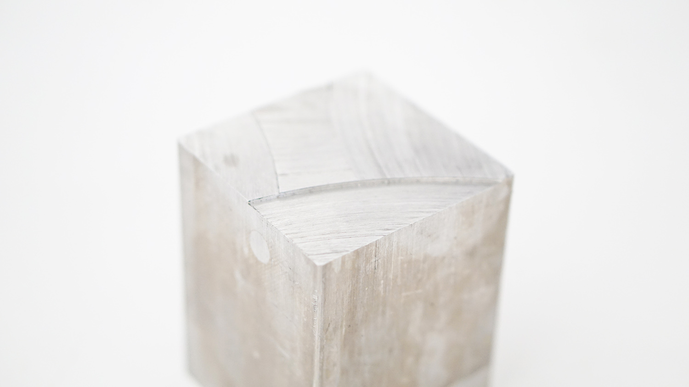
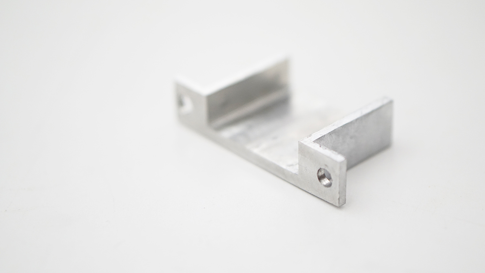
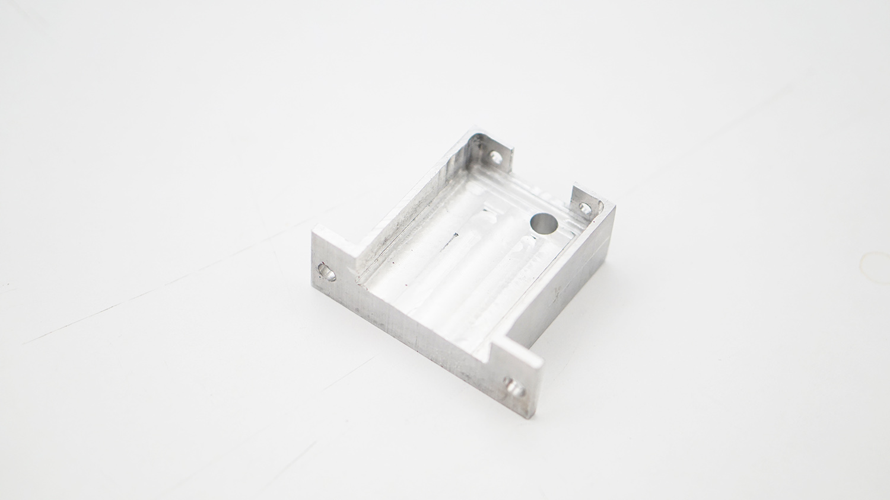

### Modifying the Extruder

The intent is to disassemble the 3D printer filament extruder and modify it to extrude the glass rod.

**Note**: The CAD file does not mention the screw tap pitch that holds the two modified parts of the extruder. Design it according to your convenience.

- Refer to the [CAD models](/quartz/docs/04-cad-models) with correct annotations for measurements while machining.
- Some dimensions may vary, it is highly suggested that you use the models as a reference and adjust the dimensions according to your extruder and glass rods.
- Use scribe tool and set squares to mark the milling points. Clamp the pieces at correct level and use a milling machine to make the modifications.
- Fit the rubber seat [washer](http://www.homedepot.com/p/DANCO-1-4-in-Faucet-Seat-Washers-for-Price-Pfister-80359/203193501) on the motor gear.
- Test if the glass rod passes well through the extruder. Look for any shaky or loose parts. The movement should be firm and smooth.

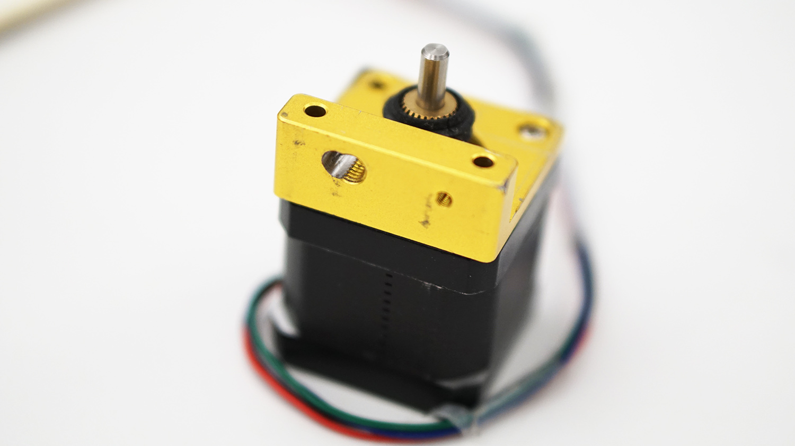
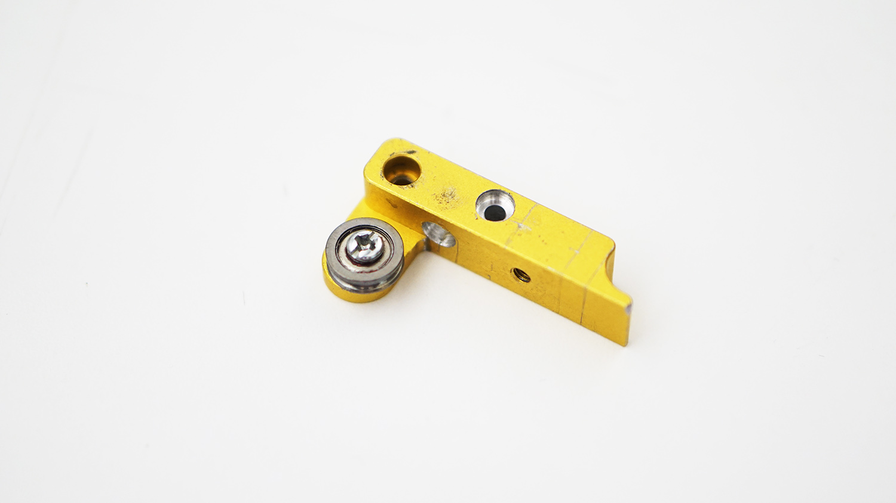
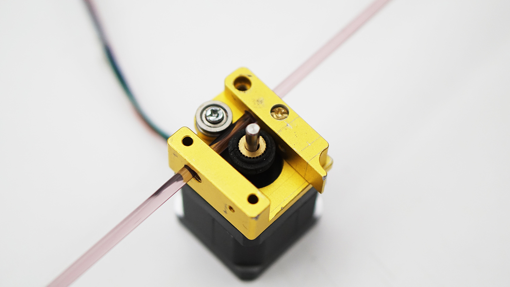
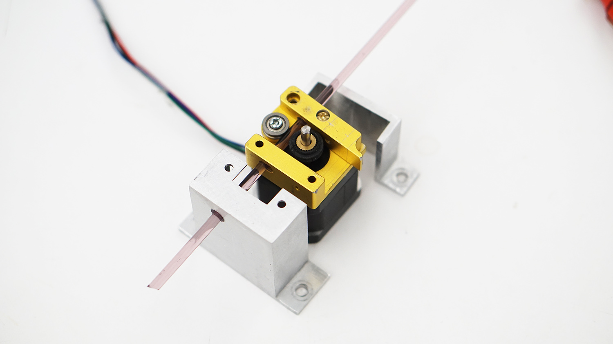

### Vacuum Assembly

- The compressed air intake of the venturi pump is connected to the pressure hose from the compressor.
- Use the NPT fittings mentioned in the [Parts List](/quartz/docs/03-parts-list).
- Connect the stainless steel hose to the vacuum side of the pump. The hose will be mounted on the machine carriage.
- The venturi pump may rest away from the machine, as long as the hoses are long enough to allow sufficient movement during extrusion.
- **Warning** — The stainless steel pipe will get hot during extrusion. It is recommended to use non-contact methods to monitor the operating temperature of the machine parts.

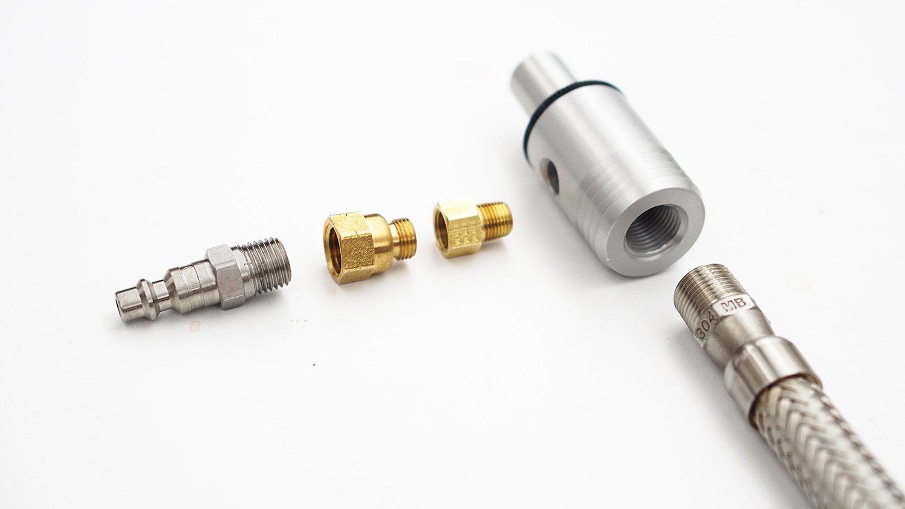
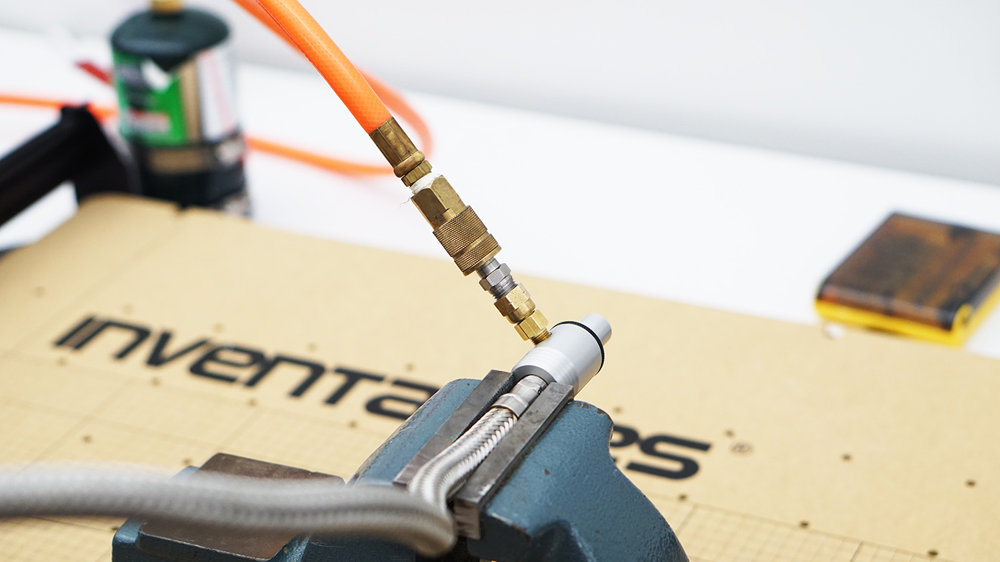

### Assembling the Machine

**Note**: First assemble the modified extruder and the extruder mounts on a Spindle Mounting Plate. Test the movement of the glass rod by simply running the stepper motor of the extruder in each direction.

- Dismount the spindle if your machine came with it.
- Take a [500mm Aluminum Extrusion](https://www.inventables.com/technologies/aluminum-extrusion-20mm-x-20mm-black) and cut it in two halves.
- Mount each half on a separate [Spindle Mounting Plate](https://www.inventables.com/technologies/spindle-mounting-plate); one for the left side that will hold the propane torch and one for the right side that will hold the vacuum tube.
- Assemble the plates in the configuration shown below.
- Make a hole in two hose clamps for mounting them on one of the Aluminium Extrusions using button cap screws and T-slot screws.
- Use zipties as shown in photos to mount the propane torch on the Aluminium Extrusion.
- The torch should feel secured in all 3 axes. The only relatively free movement will be rotational around Z-axis. Rotate the torch to aim at the glass rod. Use any appropriate methods to lock the position of the torch in place.
- Run the stainless steel hose through the hose clamps. Point its end at the glass rod and across the propane torch tip.
- Find a correct sweet spot for the suction of the air.

**Note**: If it is too close to the rod, the molten glass might get sucked in as well. Make sure it is close enough to sufficiently evacuate the flame away from everything after it heats the glass rod.

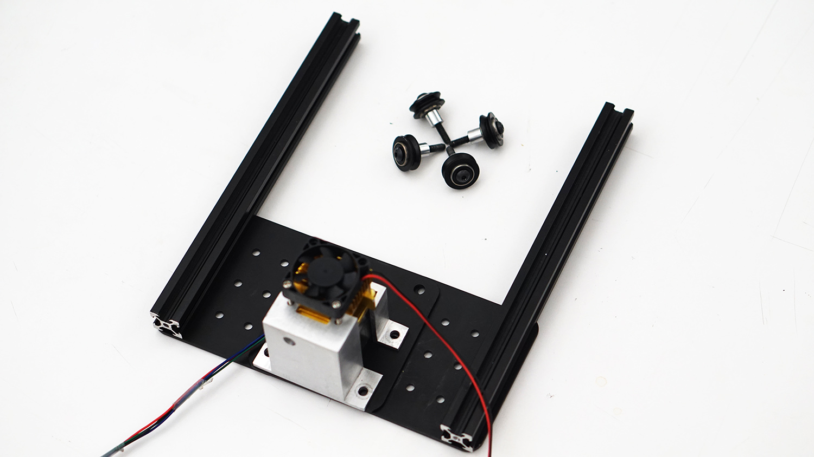
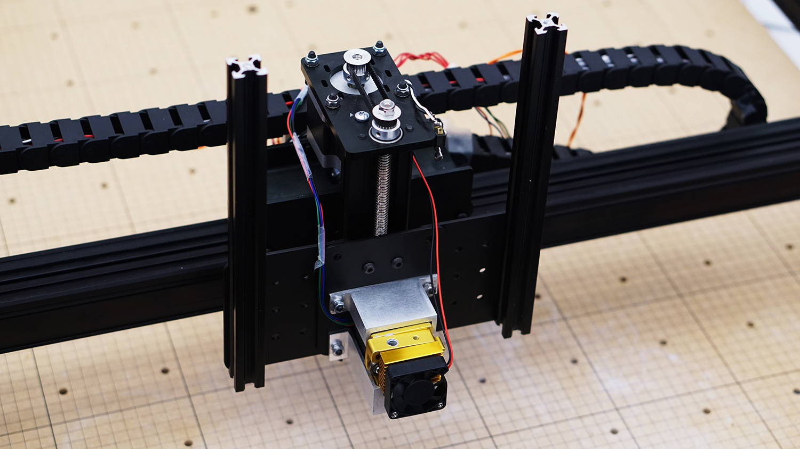
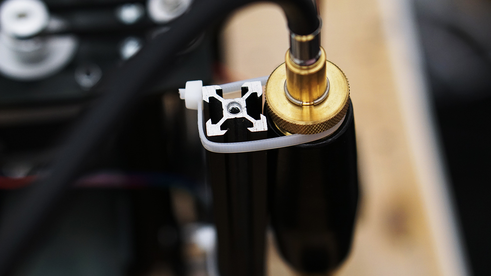
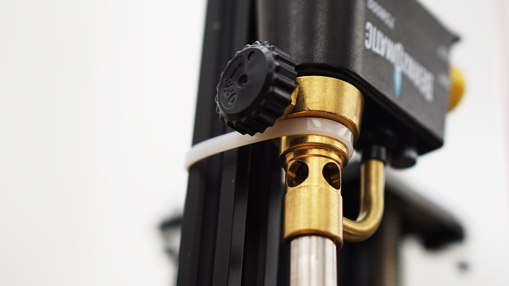
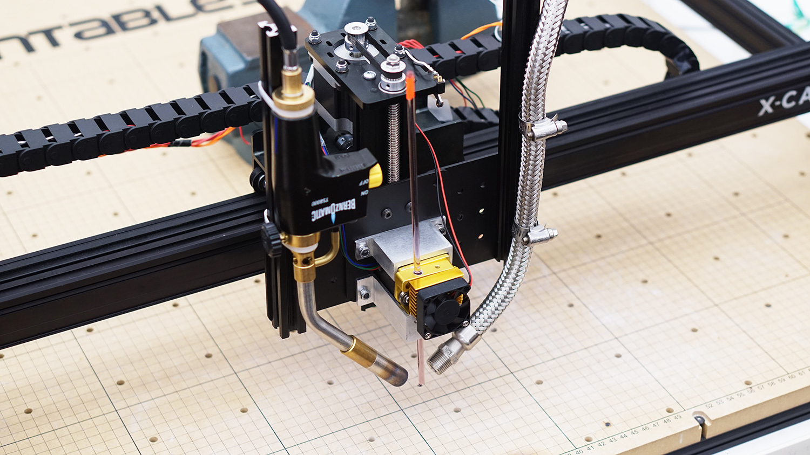
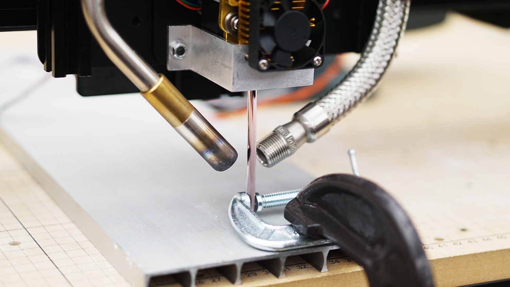
